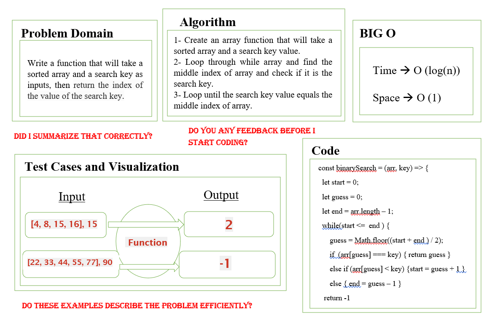

BinarySearch array:

Whiteboard Process:

***

Approach & Efficiency:

* USing while loop to etirates through the given array.

* Find the middle index of array and check if it is the search key.

* Loop until the search key value equals the middle index of array then return the index.
