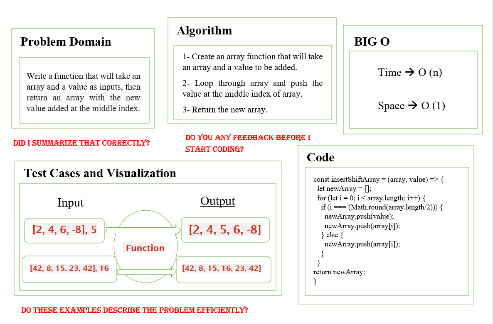
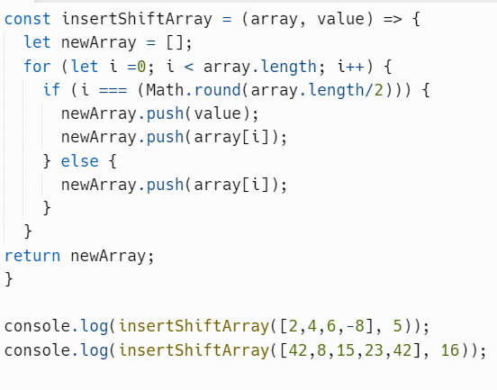
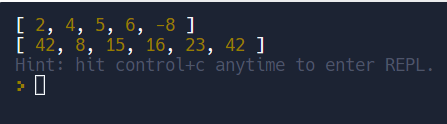

Array insert shift:

Whiteboard Process:

***

insertShiftArray function code:

***

insertShiftArray function result:

***

Approach & Efficiency:

* USing for loop to etirates through the given array.

* Push the input value at the middle index of array.

* Return the array with the added value.
