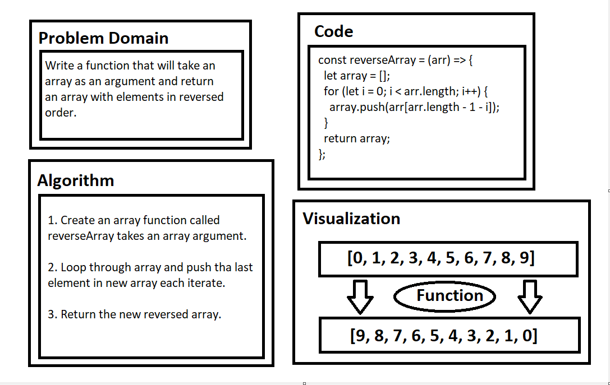
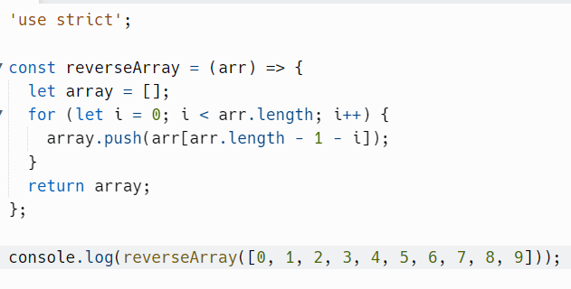
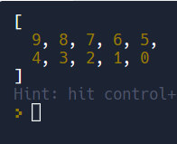

Reverse in Array:

Whiteboard Process:

***

reverseArray function code:

***

reverseArray function result:

***

Approach & Efficiency:

* USing for loop to etirates through the given array.

* Push the last element at each iterate in new array.

* Return the new array with the reversed elements.
