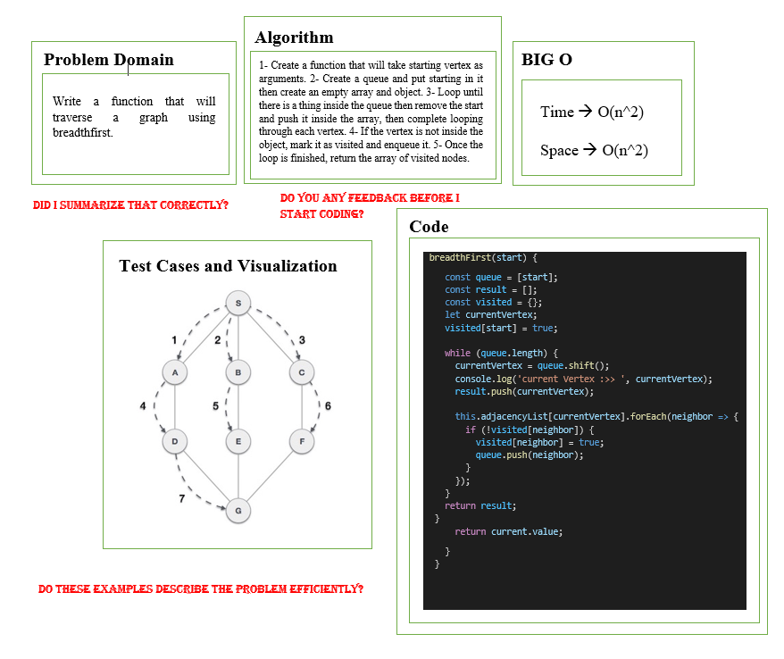

# Graph

A graph consists of a set of nodes, or vertices, connected by edges. An edge consists of a pair of vertices.

***

## Challenge

create the method that will traverse a graph using Breadth First.

***

## Write tests to prove the following functionality:

* should traverse the graph.

***

## Approach & Efficiency

* breadthFirst:

    Big O of time: O(n^2).

    Big O of space: O(n^2).

***

## White Board

