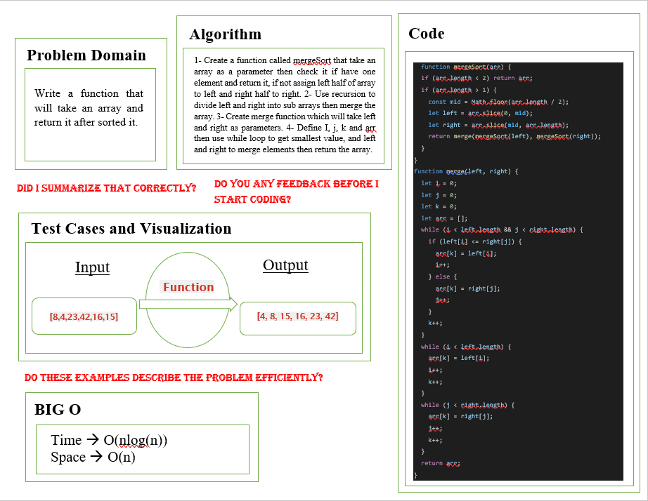

# Sorting-Insertion

## Whiteboard

## Tracing

## Approach & Efficiency

- Time Complexity: O(nlog(n)) Because mergeSort always divides the array into two halves and takes linear time to merge two halves.
- Space Complexity: O(n) Because of using space in storing the array's elements.
