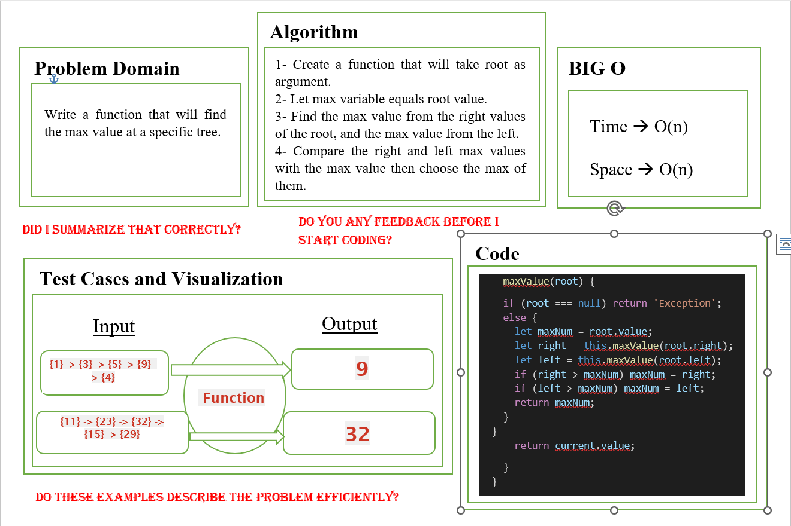

# Trees

A tree is a nonlinear data structure, compared to arrays, linked lists, stacks and queues which are linear data structures. A tree can be empty with no nodes or a tree is a structure consisting of one node called the root and zero or one or more subtrees.

## Challenge

Create Node, BinaryTree and BinarySearchTree classes and create preOrder(),inOrder(), postOrder() to traverse a tree and return it's nodes as an array of their values. Also we should create add(value) function to add a node in the correct location in the binary search tree, and contains(value) function to check if a value is existed in a binary search tree or not.

## Approach & Efficiency

- For preOrder(),inOrder() and postOrder() functions, we needed O(n) as a time complexity because traversing through nodes needs to keep tacking of the last visited node.

- For add(value) and contains(value) functions, we needed O(log(n)) as a time complexity because inserting and searching in a Binary Search Tree depends on the tree's height which equals to log(n).

- For maxValue(root): space: O(n), time: O(n).

## API

- preOrder(): Traverse a tree >> root, left, right.
- inOrder(): Traverse a tree >> left, root, right.
- postOrder(): Traverse a tree >> left, right, root.
- add(value): Add a node in the correct location in the binary search tree.
- contains(value): Check whether or not the value is in the binary search tree at least once.
- maxValue(root): Find the max value in a tree.

Whiteboard max function:

