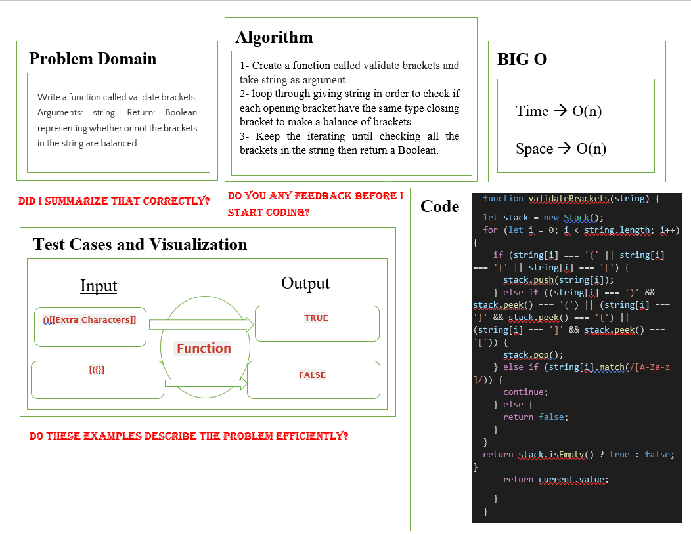

# validateBrackets.

## Challenge
We should create a function called validate brackets
Arguments: string
Return: boolean
representing whether or not the brackets in the string are balanced
<!-- Description of the challenge -->

## Approach & Efficiency
Time: O(n) space: O(n).
<!-- What approach did you take? Why? What is the Big O space/time for this approach? -->

validateBrackets White Board:

